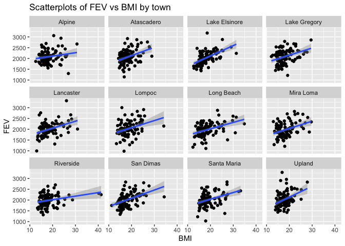
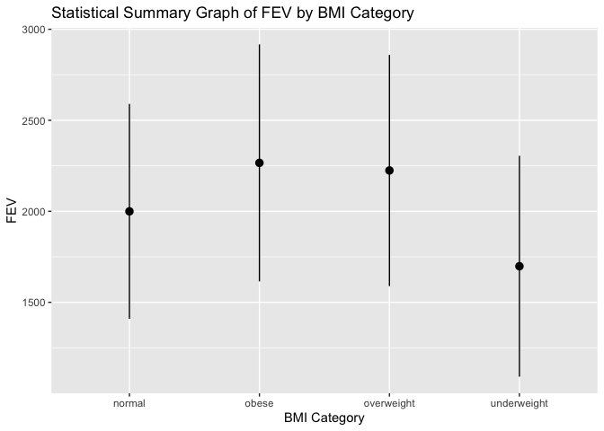

Homework 2
================
Maria Bolshakova
9/23/2020

1.Download data and merging
===========================

``` r
library(data.table)
library(leaflet)
library(tidyverse)
```

    ## ── Attaching packages ───────────────────────────────── tidyverse 1.3.0 ──

    ## ✓ ggplot2 3.3.2     ✓ purrr   0.3.4
    ## ✓ tibble  3.0.3     ✓ dplyr   1.0.1
    ## ✓ tidyr   1.1.1     ✓ stringr 1.4.0
    ## ✓ readr   1.3.1     ✓ forcats 0.5.0

    ## ── Conflicts ──────────────────────────────────── tidyverse_conflicts() ──
    ## x dplyr::between()   masks data.table::between()
    ## x dplyr::filter()    masks stats::filter()
    ## x dplyr::first()     masks data.table::first()
    ## x dplyr::lag()       masks stats::lag()
    ## x dplyr::last()      masks data.table::last()
    ## x purrr::transpose() masks data.table::transpose()

``` r
data1 <- data.table::fread('chs_individual.csv')
data2 <- data.table::fread('chs_regional.csv')
new <- merge(data1, data2,by="townname")
str(new)
```

    ## Classes 'data.table' and 'data.frame':   1200 obs. of  49 variables:
    ##  $ townname     : chr  "Alpine" "Alpine" "Alpine" "Alpine" ...
    ##  $ sid          : int  835 838 839 840 841 842 843 844 847 849 ...
    ##  $ male         : int  0 0 0 0 1 1 1 1 1 1 ...
    ##  $ race         : chr  "W" "O" "M" "W" ...
    ##  $ hispanic     : int  0 1 1 0 1 1 0 1 0 0 ...
    ##  $ agepft       : num  10.1 9.49 10.05 9.97 10.55 ...
    ##  $ height       : int  143 133 142 146 150 139 149 143 137 147 ...
    ##  $ weight       : int  69 62 86 78 78 65 98 65 69 112 ...
    ##  $ bmi          : num  15.3 15.9 19.4 16.6 15.8 ...
    ##  $ asthma       : int  0 0 0 0 0 0 0 NA 0 0 ...
    ##  $ active_asthma: int  0 0 0 0 0 0 0 0 0 0 ...
    ##  $ father_asthma: int  0 0 0 0 0 0 0 NA 0 1 ...
    ##  $ mother_asthma: int  0 0 1 0 0 0 0 NA 0 0 ...
    ##  $ wheeze       : int  0 0 1 0 0 1 1 NA 0 1 ...
    ##  $ hayfever     : int  0 0 1 0 0 0 0 NA 0 0 ...
    ##  $ allergy      : int  1 0 1 0 0 0 1 NA 0 1 ...
    ##  $ educ_parent  : int  3 4 3 NA 5 1 3 NA 5 3 ...
    ##  $ smoke        : int  0 NA 1 NA 0 1 0 NA 0 0 ...
    ##  $ pets         : int  1 1 1 0 1 1 1 0 1 1 ...
    ##  $ gasstove     : int  0 0 0 NA 0 0 1 NA 1 0 ...
    ##  $ fev          : num  2529 1738 2122 2467 2252 ...
    ##  $ fvc          : num  2826 1964 2327 2638 2595 ...
    ##  $ mmef         : num  3407 2133 2835 3466 2445 ...
    ##  $ pm25_mass    : num  8.74 8.74 8.74 8.74 8.74 8.74 8.74 8.74 8.74 8.74 ...
    ##  $ pm25_so4     : num  1.73 1.73 1.73 1.73 1.73 1.73 1.73 1.73 1.73 1.73 ...
    ##  $ pm25_no3     : num  1.59 1.59 1.59 1.59 1.59 1.59 1.59 1.59 1.59 1.59 ...
    ##  $ pm25_nh4     : num  0.88 0.88 0.88 0.88 0.88 0.88 0.88 0.88 0.88 0.88 ...
    ##  $ pm25_oc      : num  2.54 2.54 2.54 2.54 2.54 2.54 2.54 2.54 2.54 2.54 ...
    ##  $ pm25_ec      : num  0.48 0.48 0.48 0.48 0.48 0.48 0.48 0.48 0.48 0.48 ...
    ##  $ pm25_om      : num  3.04 3.04 3.04 3.04 3.04 3.04 3.04 3.04 3.04 3.04 ...
    ##  $ pm10_oc      : num  3.25 3.25 3.25 3.25 3.25 3.25 3.25 3.25 3.25 3.25 ...
    ##  $ pm10_ec      : num  0.49 0.49 0.49 0.49 0.49 0.49 0.49 0.49 0.49 0.49 ...
    ##  $ pm10_tc      : num  3.75 3.75 3.75 3.75 3.75 3.75 3.75 3.75 3.75 3.75 ...
    ##  $ formic       : num  1.03 1.03 1.03 1.03 1.03 1.03 1.03 1.03 1.03 1.03 ...
    ##  $ acetic       : num  2.49 2.49 2.49 2.49 2.49 2.49 2.49 2.49 2.49 2.49 ...
    ##  $ hcl          : num  0.41 0.41 0.41 0.41 0.41 0.41 0.41 0.41 0.41 0.41 ...
    ##  $ hno3         : num  1.98 1.98 1.98 1.98 1.98 1.98 1.98 1.98 1.98 1.98 ...
    ##  $ o3_max       : num  65.8 65.8 65.8 65.8 65.8 ...
    ##  $ o3106        : num  55 55 55 55 55 ...
    ##  $ o3_24        : num  41.2 41.2 41.2 41.2 41.2 ...
    ##  $ no2          : num  12.2 12.2 12.2 12.2 12.2 ...
    ##  $ pm10         : num  24.7 24.7 24.7 24.7 24.7 ...
    ##  $ no_24hr      : num  2.48 2.48 2.48 2.48 2.48 2.48 2.48 2.48 2.48 2.48 ...
    ##  $ pm2_5_fr     : num  10.3 10.3 10.3 10.3 10.3 ...
    ##  $ iacid        : num  2.39 2.39 2.39 2.39 2.39 2.39 2.39 2.39 2.39 2.39 ...
    ##  $ oacid        : num  3.52 3.52 3.52 3.52 3.52 3.52 3.52 3.52 3.52 3.52 ...
    ##  $ total_acids  : num  5.5 5.5 5.5 5.5 5.5 5.5 5.5 5.5 5.5 5.5 ...
    ##  $ lon          : num  -117 -117 -117 -117 -117 ...
    ##  $ lat          : num  32.8 32.8 32.8 32.8 32.8 ...
    ##  - attr(*, ".internal.selfref")=<externalptr> 
    ##  - attr(*, "sorted")= chr "townname"

2. Imputing data
----------------

``` r
new2<-new[, bmi_imp := fcoalesce(bmi, mean(bmi, na.rm = TRUE)),
    by = .(male, hispanic)]

new2[, fev_imp := fcoalesce(fev, mean(fev, na.rm = TRUE)),
    by = .(male, hispanic)]
```

3. New categorical variable of BMI
----------------------------------

``` r
new2$obesity_level <-ifelse(new2$bmi_imp <14, "underweight",
                           ifelse(new2$bmi_imp >=14 & new2$bmi_imp <22, "normal",
                           ifelse(new2$bmi_imp >=22 & new2$bmi_imp <24, "overweight", "obese")))
                                  
                                    
## Checking to make sure cateogries are correct
new2 %>%
  group_by(obesity_level) %>%
summarise(
  first=min(bmi_imp),
  last=max(bmi_imp)
)
```

    ## `summarise()` ungrouping output (override with `.groups` argument)

    ## # A tibble: 4 x 3
    ##   obesity_level first  last
    ##   <chr>         <dbl> <dbl>
    ## 1 normal         14.0  22.0
    ## 2 obese          24.0  41.3
    ## 3 overweight     22.0  24.0
    ## 4 underweight    11.3  14.0

``` r
## Number of observations per category
new2 %>% count(obesity_level)
```

    ##    obesity_level   n
    ## 1:        normal 975
    ## 2:         obese 103
    ## 3:    overweight  87
    ## 4:   underweight  35

4. Smoke and gas exposure variable
----------------------------------

``` r
new2$smoke_gas_exposure <-ifelse(new2$smoke ==0 & new2$gasstove==0, "None",
                           ifelse(new2$smoke==0 & new2$gasstove==1, "Gas Only",
                           ifelse(new2$smoke ==1 & new2$gasstove==0, "Smoke Only",
                                  ifelse(new2$smoke==1 & new2$gasstove==1, "Both", "NA"))))

## Left NA in because doesn't make sense to impute a binary variable
```

5. Summary tables
-----------------

``` r
## Mean and SD of FEV by town
new2[,list(mean=mean(fev_imp),sd=sd(fev_imp)),by=townname]
```

    ##          townname     mean       sd
    ##  1:        Alpine 2087.101 291.1768
    ##  2:    Atascadero 2075.897 324.0935
    ##  3: Lake Elsinore 2038.849 303.6956
    ##  4:  Lake Gregory 2084.700 319.9593
    ##  5:     Lancaster 2003.044 317.1298
    ##  6:        Lompoc 2034.354 351.0454
    ##  7:    Long Beach 1985.861 319.4625
    ##  8:     Mira Loma 1985.202 324.9634
    ##  9:     Riverside 1989.881 277.5065
    ## 10:     San Dimas 2026.794 318.7845
    ## 11:   Santa Maria 2025.750 312.1725
    ## 12:        Upland 2024.266 343.1637

``` r
#The town of Alpine has the highest avrage FEV

## Mean and SD of FEV by sex
new2[,list(mean=mean(fev_imp),sd=sd(fev_imp)),by=male]
```

    ##    male     mean       sd
    ## 1:    0 1958.911 311.9181
    ## 2:    1 2103.787 307.5123

``` r
#The FEv is on average higher for males

## Mean and SD of FEV by obesity level
new2[,list(mean=mean(fev_imp),sd=sd(fev_imp)),by=obesity_level]
```

    ##    obesity_level     mean       sd
    ## 1:        normal 1999.794 295.1964
    ## 2:    overweight 2224.322 317.4261
    ## 3:         obese 2266.154 325.4710
    ## 4:   underweight 1698.327 303.3983

``` r
#The highest average FEV is in the obese category

## Mean and SD of FEV by smoke/gas exposure
new2[,list(mean=mean(fev_imp),sd=sd(fev_imp)),by=smoke_gas_exposure]
```

    ##    smoke_gas_exposure     mean       sd
    ## 1:               None 2055.356 330.4169
    ## 2:               <NA> 2001.878 340.2592
    ## 3:         Smoke Only 2055.714 295.6475
    ## 4:           Gas Only 2025.989 317.6305
    ## 5:               Both 2019.867 298.9728

``` r
#The highest average FEV is in the none or smoke categories.

## Proportion of asthma diagnosis by town
mytable <- xtabs(~asthma+townname, data=new2)
ftable(mytable) # print table
```

    ##        townname Alpine Atascadero Lake Elsinore Lake Gregory Lancaster Lompoc Long Beach Mira Loma Riverside San Dimas Santa Maria Upland
    ## asthma                                                                                                                                   
    ## 0                   86         73            83           84        81     86         83        80        89        82          84     87
    ## 1                   11         25            12           15        16     11         13        15        11        17          13     12

``` r
summary(mytable) # chi-square test of indepedence
```

    ## Call: xtabs(formula = ~asthma + townname, data = new2)
    ## Number of cases in table: 1169 
    ## Number of factors: 2 
    ## Test for independence of all factors:
    ##  Chisq = 13.943, df = 11, p-value = 0.2362

``` r
#The chi sq test reveals no significant difference in asthma diagnosis across the different towns

## Proportion of asthma diagnosis by sex
mytable2 <- xtabs(~asthma+male, data=new2)
ftable(mytable2) # print table
```

    ##        male   0   1
    ## asthma             
    ## 0           524 474
    ## 1            72  99

``` r
summary(mytable2) # chi-square test of indepedence
```

    ## Call: xtabs(formula = ~asthma + male, data = new2)
    ## Number of cases in table: 1169 
    ## Number of factors: 2 
    ## Test for independence of all factors:
    ##  Chisq = 6.318, df = 1, p-value = 0.01195

``` r
#The chi sq test reveals that there is a significant difference in asthma diagnosis by sex.

## Proportion of asthma diagnosis by obesity level
mytable3 <- xtabs(~asthma+obesity_level, data=new2)
ftable(mytable3) # print table
```

    ##        obesity_level normal obese overweight underweight
    ## asthma                                                  
    ## 0                       816    79         71          32
    ## 1                       133    21         14           3

``` r
summary(mytable3) # chi-square test of indepedence
```

    ## Call: xtabs(formula = ~asthma + obesity_level, data = new2)
    ## Number of cases in table: 1169 
    ## Number of factors: 2 
    ## Test for independence of all factors:
    ##  Chisq = 4.796, df = 3, p-value = 0.1873

``` r
#The chi sq test reveals no significant difference in asthma diagnosis across the 4 categories of obesity

## Proportion of asthma diagnosis by smoke/gas exposure
mytable4 <- xtabs(~asthma+smoke_gas_exposure, data=new2)
ftable(mytable4) # print table
```

    ##        smoke_gas_exposure Both Gas Only None Smoke Only
    ## asthma                                                 
    ## 0                          127      623  179         29
    ## 1                           19      108   31          6

``` r
summary(mytable4) # chi-square test of indepedence
```

    ## Call: xtabs(formula = ~asthma + smoke_gas_exposure, data = new2)
    ## Number of cases in table: 1122 
    ## Number of factors: 2 
    ## Test for independence of all factors:
    ##  Chisq = 0.4977, df = 3, p-value = 0.9194

``` r
#The chi sq test reveals no significant difference in asthma diagnosis across the 4 categories of smoke/gas exposure 
```

Looking at Data
---------------

1. Checking data
----------------

``` r
## Already checked bmi and smoke/exposure variables previously. Smoke/exposure has some missing, and BMI and obesity category seems to be fine (min of approx 11 and max of 41). Fev and bmi have been imputed for missing data based on the average of a hispanic male. 
new2 %>%
summarise(
  first=min(fev_imp),
  last=max(fev_imp)
)
```

    ##      first     last
    ## 1 984.8485 3323.684

``` r
new2 %>%
summarise(
  first=min(pm25_mass),
  last=max(pm25_mass)
)
```

    ##   first  last
    ## 1  5.96 29.97

``` r
sum(is.na(new2$pm25_mass))
```

    ## [1] 0

``` r
##No missing values for pm2.5 mass and looks fine based on mix and max
```

Facet plot showing scatterplots with regression lines of BMI vs FEV by town
---------------------------------------------------------------------------

``` r
new2 %>%
  ggplot(mapping = aes(x=bmi_imp, y=fev_imp))+
  geom_point()+
  stat_smooth(method=lm)+
facet_wrap(~townname)+
labs(title="Scatterplots of FEV vs BMI by town", x="BMI", y="FEV")
```

    ## `geom_smooth()` using formula 'y ~ x'



``` r
#All of the town have a general positive linear trend of bmi vs fev, indicating that higher bmi results in higher FEV. However, this was not the case when we broke BMI into categories and performed a chi sq test in the previous problem. 
```

Stacked histograms of FEV by BMI category and FEV by smoke/gas exposure. Use different color schemes than the ggplot default.
-----------------------------------------------------------------------------------------------------------------------------

``` r
new2 %>%
  ggplot(aes(x=fev_imp, fill=obesity_level, color=obesity_level)) +
  scale_fill_brewer(palette="Dark2")+
  geom_histogram(position="identity")+
labs(title="Histogram of FEV by BMI Category", x="BMI Category", y="FEV")
```

    ## `stat_bin()` using `bins = 30`. Pick better value with `binwidth`.


``` r
#Since the majority of people in this dataset fall into the normal BMI category, the histogram largely is comprised of those people. While it may be easy to say that FEV is higher in those with normal BMI, I believe it is due to the larger sample size and variance.


new2 %>%
  ggplot(aes(x=fev_imp, fill=smoke_gas_exposure, color=smoke_gas_exposure)) +
  scale_fill_brewer(palette="BuPu")+
  geom_histogram(position="identity")+
labs(title="Histogram of FEV by Smoke/Gas Exposure", x="Smoke/Gas Exposure", y="FEV")
```

    ## `stat_bin()` using `bins = 30`. Pick better value with `binwidth`.


``` r
#The same is seen in this plot, in which gas only has a higher amount of observations than the other category. 
```

Barchart of BMI by smoke/gas exposure
-------------------------------------

``` r
new2 %>%
  ggplot()+
geom_bar(mapping=aes(x=obesity_level, fill=smoke_gas_exposure))+
  scale_fill_brewer(palette="Spectral")+
  labs(title="Barchart of BMI Category by Smoke/Gas Exposure")
```


``` r
#Again, the normal BMI category and gas only make up the majority of people in the data set. If the distribution of people in these categories was equal, we would see a more balanced barchart. 
```

Statistical summary graphs of FEV by BMI and FEV by smoke/gas exposure category.
--------------------------------------------------------------------------------

``` r
library(Hmisc)
```

    ## Loading required package: lattice

    ## Loading required package: survival

    ## Loading required package: Formula

    ## 
    ## Attaching package: 'Hmisc'

    ## The following objects are masked from 'package:dplyr':
    ## 
    ##     src, summarize

    ## The following objects are masked from 'package:base':
    ## 
    ##     format.pval, units

``` r
new2 %>%
  filter(!(obesity_level %in% NA)) %>%
  ggplot(mapping = aes (x=obesity_level, y=fev_imp))+
  stat_summary(fun.data="mean_sdl")+
   labs(title="Statistical Summary Graph of FEV by BMI Category", x="BMI Category", y="FEV")
```



``` r
##Statistically, those in the obese category have on average, higher FEV and underweight have the lowest.

new2 %>%
  filter(!(smoke_gas_exposure %in% NA)) %>%
  ggplot(mapping = aes (x=smoke_gas_exposure, y=fev_imp))+
  stat_summary(fun.data="mean_sdl")+
    labs(title="Statistical Summary Graph of FEV by Smoke/Gas Exposure", x="Smoke/Gas Exposure", y="FEV")
```


``` r
#Average FEV tends to be equal among the smoke/gas exposure categories
```

Leaflet map showing concentrations of PM2.5 mass in each of the CHS communities
-------------------------------------------------------------------------------

``` r
fev_imp_pal = colorNumeric(palette="Reds", domain=new2$fev_imp)

leaflet(new2) %>%
  addProviderTiles('OpenStreetMap')%>%
  addCircles(lat=~lat, lng=~lon, color=~fev_imp_pal(fev_imp), opacity=1, fillOpacity = 1, radius=500) %>%
  addLegend('bottomleft', pal=fev_imp_pal, values=new2$fev_imp, title="PM2.5 Mass Concentration", opacity=1)
```

<!--html_preserve-->

<script type="application/json" data-for="htmlwidget-2d6a53e094cfb785053b">{"x":{"options":{"crs":{"crsClass":"L.CRS.EPSG3857","code":null,"proj4def":null,"projectedBounds":null,"options":{}}},"calls":[{"method":"addProviderTiles","args":["OpenStreetMap",null,null,{"errorTileUrl":"","noWrap":false,"detectRetina":false}]},{"method":"addCircles","args":[[32.8350521,32.8350521,32.8350521,32.8350521,32.8350521,32.8350521,32.8350521,32.8350521,32.8350521,32.8350521,32.8350521,32.8350521,32.8350521,32.8350521,32.8350521,32.8350521,32.8350521,32.8350521,32.8350521,32.8350521,32.8350521,32.8350521,32.8350521,32.8350521,32.8350521,32.8350521,32.8350521,32.8350521,32.8350521,32.8350521,32.8350521,32.8350521,32.8350521,32.8350521,32.8350521,32.8350521,32.8350521,32.8350521,32.8350521,32.8350521,32.8350521,32.8350521,32.8350521,32.8350521,32.8350521,32.8350521,32.8350521,32.8350521,32.8350521,32.8350521,32.8350521,32.8350521,32.8350521,32.8350521,32.8350521,32.8350521,32.8350521,32.8350521,32.8350521,32.8350521,32.8350521,32.8350521,32.8350521,32.8350521,32.8350521,32.8350521,32.8350521,32.8350521,32.8350521,32.8350521,32.8350521,32.8350521,32.8350521,32.8350521,32.8350521,32.8350521,32.8350521,32.8350521,32.8350521,32.8350521,32.8350521,32.8350521,32.8350521,32.8350521,32.8350521,32.8350521,32.8350521,32.8350521,32.8350521,32.8350521,32.8350521,32.8350521,32.8350521,32.8350521,32.8350521,32.8350521,32.8350521,32.8350521,32.8350521,32.8350521,35.4894169,35.4894169,35.4894169,35.4894169,35.4894169,35.4894169,35.4894169,35.4894169,35.4894169,35.4894169,35.4894169,35.4894169,35.4894169,35.4894169,35.4894169,35.4894169,35.4894169,35.4894169,35.4894169,35.4894169,35.4894169,35.4894169,35.4894169,35.4894169,35.4894169,35.4894169,35.4894169,35.4894169,35.4894169,35.4894169,35.4894169,35.4894169,35.4894169,35.4894169,35.4894169,35.4894169,35.4894169,35.4894169,35.4894169,35.4894169,35.4894169,35.4894169,35.4894169,35.4894169,35.4894169,35.4894169,35.4894169,35.4894169,35.4894169,35.4894169,35.4894169,35.4894169,35.4894169,35.4894169,35.4894169,35.4894169,35.4894169,35.4894169,35.4894169,35.4894169,35.4894169,35.4894169,35.4894169,35.4894169,35.4894169,35.4894169,35.4894169,35.4894169,35.4894169,35.4894169,35.4894169,35.4894169,35.4894169,35.4894169,35.4894169,35.4894169,35.4894169,35.4894169,35.4894169,35.4894169,35.4894169,35.4894169,35.4894169,35.4894169,35.4894169,35.4894169,35.4894169,35.4894169,35.4894169,35.4894169,35.4894169,35.4894169,35.4894169,35.4894169,35.4894169,35.4894169,35.4894169,35.4894169,35.4894169,35.4894169,33.6680772,33.6680772,33.6680772,33.6680772,33.6680772,33.6680772,33.6680772,33.6680772,33.6680772,33.6680772,33.6680772,33.6680772,33.6680772,33.6680772,33.6680772,33.6680772,33.6680772,33.6680772,33.6680772,33.6680772,33.6680772,33.6680772,33.6680772,33.6680772,33.6680772,33.6680772,33.6680772,33.6680772,33.6680772,33.6680772,33.6680772,33.6680772,33.6680772,33.6680772,33.6680772,33.6680772,33.6680772,33.6680772,33.6680772,33.6680772,33.6680772,33.6680772,33.6680772,33.6680772,33.6680772,33.6680772,33.6680772,33.6680772,33.6680772,33.6680772,33.6680772,33.6680772,33.6680772,33.6680772,33.6680772,33.6680772,33.6680772,33.6680772,33.6680772,33.6680772,33.6680772,33.6680772,33.6680772,33.6680772,33.6680772,33.6680772,33.6680772,33.6680772,33.6680772,33.6680772,33.6680772,33.6680772,33.6680772,33.6680772,33.6680772,33.6680772,33.6680772,33.6680772,33.6680772,33.6680772,33.6680772,33.6680772,33.6680772,33.6680772,33.6680772,33.6680772,33.6680772,33.6680772,33.6680772,33.6680772,33.6680772,33.6680772,33.6680772,33.6680772,33.6680772,33.6680772,33.6680772,33.6680772,33.6680772,33.6680772,34.242901,34.242901,34.242901,34.242901,34.242901,34.242901,34.242901,34.242901,34.242901,34.242901,34.242901,34.242901,34.242901,34.242901,34.242901,34.242901,34.242901,34.242901,34.242901,34.242901,34.242901,34.242901,34.242901,34.242901,34.242901,34.242901,34.242901,34.242901,34.242901,34.242901,34.242901,34.242901,34.242901,34.242901,34.242901,34.242901,34.242901,34.242901,34.242901,34.242901,34.242901,34.242901,34.242901,34.242901,34.242901,34.242901,34.242901,34.242901,34.242901,34.242901,34.242901,34.242901,34.242901,34.242901,34.242901,34.242901,34.242901,34.242901,34.242901,34.242901,34.242901,34.242901,34.242901,34.242901,34.242901,34.242901,34.242901,34.242901,34.242901,34.242901,34.242901,34.242901,34.242901,34.242901,34.242901,34.242901,34.242901,34.242901,34.242901,34.242901,34.242901,34.242901,34.242901,34.242901,34.242901,34.242901,34.242901,34.242901,34.242901,34.242901,34.242901,34.242901,34.242901,34.242901,34.242901,34.242901,34.242901,34.242901,34.242901,34.242901,34.6867846,34.6867846,34.6867846,34.6867846,34.6867846,34.6867846,34.6867846,34.6867846,34.6867846,34.6867846,34.6867846,34.6867846,34.6867846,34.6867846,34.6867846,34.6867846,34.6867846,34.6867846,34.6867846,34.6867846,34.6867846,34.6867846,34.6867846,34.6867846,34.6867846,34.6867846,34.6867846,34.6867846,34.6867846,34.6867846,34.6867846,34.6867846,34.6867846,34.6867846,34.6867846,34.6867846,34.6867846,34.6867846,34.6867846,34.6867846,34.6867846,34.6867846,34.6867846,34.6867846,34.6867846,34.6867846,34.6867846,34.6867846,34.6867846,34.6867846,34.6867846,34.6867846,34.6867846,34.6867846,34.6867846,34.6867846,34.6867846,34.6867846,34.6867846,34.6867846,34.6867846,34.6867846,34.6867846,34.6867846,34.6867846,34.6867846,34.6867846,34.6867846,34.6867846,34.6867846,34.6867846,34.6867846,34.6867846,34.6867846,34.6867846,34.6867846,34.6867846,34.6867846,34.6867846,34.6867846,34.6867846,34.6867846,34.6867846,34.6867846,34.6867846,34.6867846,34.6867846,34.6867846,34.6867846,34.6867846,34.6867846,34.6867846,34.6867846,34.6867846,34.6867846,34.6867846,34.6867846,34.6867846,34.6867846,34.6867846,34.6391501,34.6391501,34.6391501,34.6391501,34.6391501,34.6391501,34.6391501,34.6391501,34.6391501,34.6391501,34.6391501,34.6391501,34.6391501,34.6391501,34.6391501,34.6391501,34.6391501,34.6391501,34.6391501,34.6391501,34.6391501,34.6391501,34.6391501,34.6391501,34.6391501,34.6391501,34.6391501,34.6391501,34.6391501,34.6391501,34.6391501,34.6391501,34.6391501,34.6391501,34.6391501,34.6391501,34.6391501,34.6391501,34.6391501,34.6391501,34.6391501,34.6391501,34.6391501,34.6391501,34.6391501,34.6391501,34.6391501,34.6391501,34.6391501,34.6391501,34.6391501,34.6391501,34.6391501,34.6391501,34.6391501,34.6391501,34.6391501,34.6391501,34.6391501,34.6391501,34.6391501,34.6391501,34.6391501,34.6391501,34.6391501,34.6391501,34.6391501,34.6391501,34.6391501,34.6391501,34.6391501,34.6391501,34.6391501,34.6391501,34.6391501,34.6391501,34.6391501,34.6391501,34.6391501,34.6391501,34.6391501,34.6391501,34.6391501,34.6391501,34.6391501,34.6391501,34.6391501,34.6391501,34.6391501,34.6391501,34.6391501,34.6391501,34.6391501,34.6391501,34.6391501,34.6391501,34.6391501,34.6391501,34.6391501,34.6391501,33.7700504,33.7700504,33.7700504,33.7700504,33.7700504,33.7700504,33.7700504,33.7700504,33.7700504,33.7700504,33.7700504,33.7700504,33.7700504,33.7700504,33.7700504,33.7700504,33.7700504,33.7700504,33.7700504,33.7700504,33.7700504,33.7700504,33.7700504,33.7700504,33.7700504,33.7700504,33.7700504,33.7700504,33.7700504,33.7700504,33.7700504,33.7700504,33.7700504,33.7700504,33.7700504,33.7700504,33.7700504,33.7700504,33.7700504,33.7700504,33.7700504,33.7700504,33.7700504,33.7700504,33.7700504,33.7700504,33.7700504,33.7700504,33.7700504,33.7700504,33.7700504,33.7700504,33.7700504,33.7700504,33.7700504,33.7700504,33.7700504,33.7700504,33.7700504,33.7700504,33.7700504,33.7700504,33.7700504,33.7700504,33.7700504,33.7700504,33.7700504,33.7700504,33.7700504,33.7700504,33.7700504,33.7700504,33.7700504,33.7700504,33.7700504,33.7700504,33.7700504,33.7700504,33.7700504,33.7700504,33.7700504,33.7700504,33.7700504,33.7700504,33.7700504,33.7700504,33.7700504,33.7700504,33.7700504,33.7700504,33.7700504,33.7700504,33.7700504,33.7700504,33.7700504,33.7700504,33.7700504,33.7700504,33.7700504,33.7700504,33.9845417,33.9845417,33.9845417,33.9845417,33.9845417,33.9845417,33.9845417,33.9845417,33.9845417,33.9845417,33.9845417,33.9845417,33.9845417,33.9845417,33.9845417,33.9845417,33.9845417,33.9845417,33.9845417,33.9845417,33.9845417,33.9845417,33.9845417,33.9845417,33.9845417,33.9845417,33.9845417,33.9845417,33.9845417,33.9845417,33.9845417,33.9845417,33.9845417,33.9845417,33.9845417,33.9845417,33.9845417,33.9845417,33.9845417,33.9845417,33.9845417,33.9845417,33.9845417,33.9845417,33.9845417,33.9845417,33.9845417,33.9845417,33.9845417,33.9845417,33.9845417,33.9845417,33.9845417,33.9845417,33.9845417,33.9845417,33.9845417,33.9845417,33.9845417,33.9845417,33.9845417,33.9845417,33.9845417,33.9845417,33.9845417,33.9845417,33.9845417,33.9845417,33.9845417,33.9845417,33.9845417,33.9845417,33.9845417,33.9845417,33.9845417,33.9845417,33.9845417,33.9845417,33.9845417,33.9845417,33.9845417,33.9845417,33.9845417,33.9845417,33.9845417,33.9845417,33.9845417,33.9845417,33.9845417,33.9845417,33.9845417,33.9845417,33.9845417,33.9845417,33.9845417,33.9845417,33.9845417,33.9845417,33.9845417,33.9845417,33.9806005,33.9806005,33.9806005,33.9806005,33.9806005,33.9806005,33.9806005,33.9806005,33.9806005,33.9806005,33.9806005,33.9806005,33.9806005,33.9806005,33.9806005,33.9806005,33.9806005,33.9806005,33.9806005,33.9806005,33.9806005,33.9806005,33.9806005,33.9806005,33.9806005,33.9806005,33.9806005,33.9806005,33.9806005,33.9806005,33.9806005,33.9806005,33.9806005,33.9806005,33.9806005,33.9806005,33.9806005,33.9806005,33.9806005,33.9806005,33.9806005,33.9806005,33.9806005,33.9806005,33.9806005,33.9806005,33.9806005,33.9806005,33.9806005,33.9806005,33.9806005,33.9806005,33.9806005,33.9806005,33.9806005,33.9806005,33.9806005,33.9806005,33.9806005,33.9806005,33.9806005,33.9806005,33.9806005,33.9806005,33.9806005,33.9806005,33.9806005,33.9806005,33.9806005,33.9806005,33.9806005,33.9806005,33.9806005,33.9806005,33.9806005,33.9806005,33.9806005,33.9806005,33.9806005,33.9806005,33.9806005,33.9806005,33.9806005,33.9806005,33.9806005,33.9806005,33.9806005,33.9806005,33.9806005,33.9806005,33.9806005,33.9806005,33.9806005,33.9806005,33.9806005,33.9806005,33.9806005,33.9806005,33.9806005,33.9806005,34.1066756,34.1066756,34.1066756,34.1066756,34.1066756,34.1066756,34.1066756,34.1066756,34.1066756,34.1066756,34.1066756,34.1066756,34.1066756,34.1066756,34.1066756,34.1066756,34.1066756,34.1066756,34.1066756,34.1066756,34.1066756,34.1066756,34.1066756,34.1066756,34.1066756,34.1066756,34.1066756,34.1066756,34.1066756,34.1066756,34.1066756,34.1066756,34.1066756,34.1066756,34.1066756,34.1066756,34.1066756,34.1066756,34.1066756,34.1066756,34.1066756,34.1066756,34.1066756,34.1066756,34.1066756,34.1066756,34.1066756,34.1066756,34.1066756,34.1066756,34.1066756,34.1066756,34.1066756,34.1066756,34.1066756,34.1066756,34.1066756,34.1066756,34.1066756,34.1066756,34.1066756,34.1066756,34.1066756,34.1066756,34.1066756,34.1066756,34.1066756,34.1066756,34.1066756,34.1066756,34.1066756,34.1066756,34.1066756,34.1066756,34.1066756,34.1066756,34.1066756,34.1066756,34.1066756,34.1066756,34.1066756,34.1066756,34.1066756,34.1066756,34.1066756,34.1066756,34.1066756,34.1066756,34.1066756,34.1066756,34.1066756,34.1066756,34.1066756,34.1066756,34.1066756,34.1066756,34.1066756,34.1066756,34.1066756,34.1066756,34.9530337,34.9530337,34.9530337,34.9530337,34.9530337,34.9530337,34.9530337,34.9530337,34.9530337,34.9530337,34.9530337,34.9530337,34.9530337,34.9530337,34.9530337,34.9530337,34.9530337,34.9530337,34.9530337,34.9530337,34.9530337,34.9530337,34.9530337,34.9530337,34.9530337,34.9530337,34.9530337,34.9530337,34.9530337,34.9530337,34.9530337,34.9530337,34.9530337,34.9530337,34.9530337,34.9530337,34.9530337,34.9530337,34.9530337,34.9530337,34.9530337,34.9530337,34.9530337,34.9530337,34.9530337,34.9530337,34.9530337,34.9530337,34.9530337,34.9530337,34.9530337,34.9530337,34.9530337,34.9530337,34.9530337,34.9530337,34.9530337,34.9530337,34.9530337,34.9530337,34.9530337,34.9530337,34.9530337,34.9530337,34.9530337,34.9530337,34.9530337,34.9530337,34.9530337,34.9530337,34.9530337,34.9530337,34.9530337,34.9530337,34.9530337,34.9530337,34.9530337,34.9530337,34.9530337,34.9530337,34.9530337,34.9530337,34.9530337,34.9530337,34.9530337,34.9530337,34.9530337,34.9530337,34.9530337,34.9530337,34.9530337,34.9530337,34.9530337,34.9530337,34.9530337,34.9530337,34.9530337,34.9530337,34.9530337,34.9530337,34.09751,34.09751,34.09751,34.09751,34.09751,34.09751,34.09751,34.09751,34.09751,34.09751,34.09751,34.09751,34.09751,34.09751,34.09751,34.09751,34.09751,34.09751,34.09751,34.09751,34.09751,34.09751,34.09751,34.09751,34.09751,34.09751,34.09751,34.09751,34.09751,34.09751,34.09751,34.09751,34.09751,34.09751,34.09751,34.09751,34.09751,34.09751,34.09751,34.09751,34.09751,34.09751,34.09751,34.09751,34.09751,34.09751,34.09751,34.09751,34.09751,34.09751,34.09751,34.09751,34.09751,34.09751,34.09751,34.09751,34.09751,34.09751,34.09751,34.09751,34.09751,34.09751,34.09751,34.09751,34.09751,34.09751,34.09751,34.09751,34.09751,34.09751,34.09751,34.09751,34.09751,34.09751,34.09751,34.09751,34.09751,34.09751,34.09751,34.09751,34.09751,34.09751,34.09751,34.09751,34.09751,34.09751,34.09751,34.09751,34.09751,34.09751,34.09751,34.09751,34.09751,34.09751,34.09751,34.09751,34.09751,34.09751,34.09751,34.09751],[-116.7664109,-116.7664109,-116.7664109,-116.7664109,-116.7664109,-116.7664109,-116.7664109,-116.7664109,-116.7664109,-116.7664109,-116.7664109,-116.7664109,-116.7664109,-116.7664109,-116.7664109,-116.7664109,-116.7664109,-116.7664109,-116.7664109,-116.7664109,-116.7664109,-116.7664109,-116.7664109,-116.7664109,-116.7664109,-116.7664109,-116.7664109,-116.7664109,-116.7664109,-116.7664109,-116.7664109,-116.7664109,-116.7664109,-116.7664109,-116.7664109,-116.7664109,-116.7664109,-116.7664109,-116.7664109,-116.7664109,-116.7664109,-116.7664109,-116.7664109,-116.7664109,-116.7664109,-116.7664109,-116.7664109,-116.7664109,-116.7664109,-116.7664109,-116.7664109,-116.7664109,-116.7664109,-116.7664109,-116.7664109,-116.7664109,-116.7664109,-116.7664109,-116.7664109,-116.7664109,-116.7664109,-116.7664109,-116.7664109,-116.7664109,-116.7664109,-116.7664109,-116.7664109,-116.7664109,-116.7664109,-116.7664109,-116.7664109,-116.7664109,-116.7664109,-116.7664109,-116.7664109,-116.7664109,-116.7664109,-116.7664109,-116.7664109,-116.7664109,-116.7664109,-116.7664109,-116.7664109,-116.7664109,-116.7664109,-116.7664109,-116.7664109,-116.7664109,-116.7664109,-116.7664109,-116.7664109,-116.7664109,-116.7664109,-116.7664109,-116.7664109,-116.7664109,-116.7664109,-116.7664109,-116.7664109,-116.7664109,-120.6707255,-120.6707255,-120.6707255,-120.6707255,-120.6707255,-120.6707255,-120.6707255,-120.6707255,-120.6707255,-120.6707255,-120.6707255,-120.6707255,-120.6707255,-120.6707255,-120.6707255,-120.6707255,-120.6707255,-120.6707255,-120.6707255,-120.6707255,-120.6707255,-120.6707255,-120.6707255,-120.6707255,-120.6707255,-120.6707255,-120.6707255,-120.6707255,-120.6707255,-120.6707255,-120.6707255,-120.6707255,-120.6707255,-120.6707255,-120.6707255,-120.6707255,-120.6707255,-120.6707255,-120.6707255,-120.6707255,-120.6707255,-120.6707255,-120.6707255,-120.6707255,-120.6707255,-120.6707255,-120.6707255,-120.6707255,-120.6707255,-120.6707255,-120.6707255,-120.6707255,-120.6707255,-120.6707255,-120.6707255,-120.6707255,-120.6707255,-120.6707255,-120.6707255,-120.6707255,-120.6707255,-120.6707255,-120.6707255,-120.6707255,-120.6707255,-120.6707255,-120.6707255,-120.6707255,-120.6707255,-120.6707255,-120.6707255,-120.6707255,-120.6707255,-120.6707255,-120.6707255,-120.6707255,-120.6707255,-120.6707255,-120.6707255,-120.6707255,-120.6707255,-120.6707255,-120.6707255,-120.6707255,-120.6707255,-120.6707255,-120.6707255,-120.6707255,-120.6707255,-120.6707255,-120.6707255,-120.6707255,-120.6707255,-120.6707255,-120.6707255,-120.6707255,-120.6707255,-120.6707255,-120.6707255,-120.6707255,-117.3272615,-117.3272615,-117.3272615,-117.3272615,-117.3272615,-117.3272615,-117.3272615,-117.3272615,-117.3272615,-117.3272615,-117.3272615,-117.3272615,-117.3272615,-117.3272615,-117.3272615,-117.3272615,-117.3272615,-117.3272615,-117.3272615,-117.3272615,-117.3272615,-117.3272615,-117.3272615,-117.3272615,-117.3272615,-117.3272615,-117.3272615,-117.3272615,-117.3272615,-117.3272615,-117.3272615,-117.3272615,-117.3272615,-117.3272615,-117.3272615,-117.3272615,-117.3272615,-117.3272615,-117.3272615,-117.3272615,-117.3272615,-117.3272615,-117.3272615,-117.3272615,-117.3272615,-117.3272615,-117.3272615,-117.3272615,-117.3272615,-117.3272615,-117.3272615,-117.3272615,-117.3272615,-117.3272615,-117.3272615,-117.3272615,-117.3272615,-117.3272615,-117.3272615,-117.3272615,-117.3272615,-117.3272615,-117.3272615,-117.3272615,-117.3272615,-117.3272615,-117.3272615,-117.3272615,-117.3272615,-117.3272615,-117.3272615,-117.3272615,-117.3272615,-117.3272615,-117.3272615,-117.3272615,-117.3272615,-117.3272615,-117.3272615,-117.3272615,-117.3272615,-117.3272615,-117.3272615,-117.3272615,-117.3272615,-117.3272615,-117.3272615,-117.3272615,-117.3272615,-117.3272615,-117.3272615,-117.3272615,-117.3272615,-117.3272615,-117.3272615,-117.3272615,-117.3272615,-117.3272615,-117.3272615,-117.3272615,-117.275233,-117.275233,-117.275233,-117.275233,-117.275233,-117.275233,-117.275233,-117.275233,-117.275233,-117.275233,-117.275233,-117.275233,-117.275233,-117.275233,-117.275233,-117.275233,-117.275233,-117.275233,-117.275233,-117.275233,-117.275233,-117.275233,-117.275233,-117.275233,-117.275233,-117.275233,-117.275233,-117.275233,-117.275233,-117.275233,-117.275233,-117.275233,-117.275233,-117.275233,-117.275233,-117.275233,-117.275233,-117.275233,-117.275233,-117.275233,-117.275233,-117.275233,-117.275233,-117.275233,-117.275233,-117.275233,-117.275233,-117.275233,-117.275233,-117.275233,-117.275233,-117.275233,-117.275233,-117.275233,-117.275233,-117.275233,-117.275233,-117.275233,-117.275233,-117.275233,-117.275233,-117.275233,-117.275233,-117.275233,-117.275233,-117.275233,-117.275233,-117.275233,-117.275233,-117.275233,-117.275233,-117.275233,-117.275233,-117.275233,-117.275233,-117.275233,-117.275233,-117.275233,-117.275233,-117.275233,-117.275233,-117.275233,-117.275233,-117.275233,-117.275233,-117.275233,-117.275233,-117.275233,-117.275233,-117.275233,-117.275233,-117.275233,-117.275233,-117.275233,-117.275233,-117.275233,-117.275233,-117.275233,-117.275233,-117.275233,-118.1541632,-118.1541632,-118.1541632,-118.1541632,-118.1541632,-118.1541632,-118.1541632,-118.1541632,-118.1541632,-118.1541632,-118.1541632,-118.1541632,-118.1541632,-118.1541632,-118.1541632,-118.1541632,-118.1541632,-118.1541632,-118.1541632,-118.1541632,-118.1541632,-118.1541632,-118.1541632,-118.1541632,-118.1541632,-118.1541632,-118.1541632,-118.1541632,-118.1541632,-118.1541632,-118.1541632,-118.1541632,-118.1541632,-118.1541632,-118.1541632,-118.1541632,-118.1541632,-118.1541632,-118.1541632,-118.1541632,-118.1541632,-118.1541632,-118.1541632,-118.1541632,-118.1541632,-118.1541632,-118.1541632,-118.1541632,-118.1541632,-118.1541632,-118.1541632,-118.1541632,-118.1541632,-118.1541632,-118.1541632,-118.1541632,-118.1541632,-118.1541632,-118.1541632,-118.1541632,-118.1541632,-118.1541632,-118.1541632,-118.1541632,-118.1541632,-118.1541632,-118.1541632,-118.1541632,-118.1541632,-118.1541632,-118.1541632,-118.1541632,-118.1541632,-118.1541632,-118.1541632,-118.1541632,-118.1541632,-118.1541632,-118.1541632,-118.1541632,-118.1541632,-118.1541632,-118.1541632,-118.1541632,-118.1541632,-118.1541632,-118.1541632,-118.1541632,-118.1541632,-118.1541632,-118.1541632,-118.1541632,-118.1541632,-118.1541632,-118.1541632,-118.1541632,-118.1541632,-118.1541632,-118.1541632,-118.1541632,-120.4579409,-120.4579409,-120.4579409,-120.4579409,-120.4579409,-120.4579409,-120.4579409,-120.4579409,-120.4579409,-120.4579409,-120.4579409,-120.4579409,-120.4579409,-120.4579409,-120.4579409,-120.4579409,-120.4579409,-120.4579409,-120.4579409,-120.4579409,-120.4579409,-120.4579409,-120.4579409,-120.4579409,-120.4579409,-120.4579409,-120.4579409,-120.4579409,-120.4579409,-120.4579409,-120.4579409,-120.4579409,-120.4579409,-120.4579409,-120.4579409,-120.4579409,-120.4579409,-120.4579409,-120.4579409,-120.4579409,-120.4579409,-120.4579409,-120.4579409,-120.4579409,-120.4579409,-120.4579409,-120.4579409,-120.4579409,-120.4579409,-120.4579409,-120.4579409,-120.4579409,-120.4579409,-120.4579409,-120.4579409,-120.4579409,-120.4579409,-120.4579409,-120.4579409,-120.4579409,-120.4579409,-120.4579409,-120.4579409,-120.4579409,-120.4579409,-120.4579409,-120.4579409,-120.4579409,-120.4579409,-120.4579409,-120.4579409,-120.4579409,-120.4579409,-120.4579409,-120.4579409,-120.4579409,-120.4579409,-120.4579409,-120.4579409,-120.4579409,-120.4579409,-120.4579409,-120.4579409,-120.4579409,-120.4579409,-120.4579409,-120.4579409,-120.4579409,-120.4579409,-120.4579409,-120.4579409,-120.4579409,-120.4579409,-120.4579409,-120.4579409,-120.4579409,-120.4579409,-120.4579409,-120.4579409,-120.4579409,-118.1937395,-118.1937395,-118.1937395,-118.1937395,-118.1937395,-118.1937395,-118.1937395,-118.1937395,-118.1937395,-118.1937395,-118.1937395,-118.1937395,-118.1937395,-118.1937395,-118.1937395,-118.1937395,-118.1937395,-118.1937395,-118.1937395,-118.1937395,-118.1937395,-118.1937395,-118.1937395,-118.1937395,-118.1937395,-118.1937395,-118.1937395,-118.1937395,-118.1937395,-118.1937395,-118.1937395,-118.1937395,-118.1937395,-118.1937395,-118.1937395,-118.1937395,-118.1937395,-118.1937395,-118.1937395,-118.1937395,-118.1937395,-118.1937395,-118.1937395,-118.1937395,-118.1937395,-118.1937395,-118.1937395,-118.1937395,-118.1937395,-118.1937395,-118.1937395,-118.1937395,-118.1937395,-118.1937395,-118.1937395,-118.1937395,-118.1937395,-118.1937395,-118.1937395,-118.1937395,-118.1937395,-118.1937395,-118.1937395,-118.1937395,-118.1937395,-118.1937395,-118.1937395,-118.1937395,-118.1937395,-118.1937395,-118.1937395,-118.1937395,-118.1937395,-118.1937395,-118.1937395,-118.1937395,-118.1937395,-118.1937395,-118.1937395,-118.1937395,-118.1937395,-118.1937395,-118.1937395,-118.1937395,-118.1937395,-118.1937395,-118.1937395,-118.1937395,-118.1937395,-118.1937395,-118.1937395,-118.1937395,-118.1937395,-118.1937395,-118.1937395,-118.1937395,-118.1937395,-118.1937395,-118.1937395,-118.1937395,-117.5159449,-117.5159449,-117.5159449,-117.5159449,-117.5159449,-117.5159449,-117.5159449,-117.5159449,-117.5159449,-117.5159449,-117.5159449,-117.5159449,-117.5159449,-117.5159449,-117.5159449,-117.5159449,-117.5159449,-117.5159449,-117.5159449,-117.5159449,-117.5159449,-117.5159449,-117.5159449,-117.5159449,-117.5159449,-117.5159449,-117.5159449,-117.5159449,-117.5159449,-117.5159449,-117.5159449,-117.5159449,-117.5159449,-117.5159449,-117.5159449,-117.5159449,-117.5159449,-117.5159449,-117.5159449,-117.5159449,-117.5159449,-117.5159449,-117.5159449,-117.5159449,-117.5159449,-117.5159449,-117.5159449,-117.5159449,-117.5159449,-117.5159449,-117.5159449,-117.5159449,-117.5159449,-117.5159449,-117.5159449,-117.5159449,-117.5159449,-117.5159449,-117.5159449,-117.5159449,-117.5159449,-117.5159449,-117.5159449,-117.5159449,-117.5159449,-117.5159449,-117.5159449,-117.5159449,-117.5159449,-117.5159449,-117.5159449,-117.5159449,-117.5159449,-117.5159449,-117.5159449,-117.5159449,-117.5159449,-117.5159449,-117.5159449,-117.5159449,-117.5159449,-117.5159449,-117.5159449,-117.5159449,-117.5159449,-117.5159449,-117.5159449,-117.5159449,-117.5159449,-117.5159449,-117.5159449,-117.5159449,-117.5159449,-117.5159449,-117.5159449,-117.5159449,-117.5159449,-117.5159449,-117.5159449,-117.5159449,-117.3754942,-117.3754942,-117.3754942,-117.3754942,-117.3754942,-117.3754942,-117.3754942,-117.3754942,-117.3754942,-117.3754942,-117.3754942,-117.3754942,-117.3754942,-117.3754942,-117.3754942,-117.3754942,-117.3754942,-117.3754942,-117.3754942,-117.3754942,-117.3754942,-117.3754942,-117.3754942,-117.3754942,-117.3754942,-117.3754942,-117.3754942,-117.3754942,-117.3754942,-117.3754942,-117.3754942,-117.3754942,-117.3754942,-117.3754942,-117.3754942,-117.3754942,-117.3754942,-117.3754942,-117.3754942,-117.3754942,-117.3754942,-117.3754942,-117.3754942,-117.3754942,-117.3754942,-117.3754942,-117.3754942,-117.3754942,-117.3754942,-117.3754942,-117.3754942,-117.3754942,-117.3754942,-117.3754942,-117.3754942,-117.3754942,-117.3754942,-117.3754942,-117.3754942,-117.3754942,-117.3754942,-117.3754942,-117.3754942,-117.3754942,-117.3754942,-117.3754942,-117.3754942,-117.3754942,-117.3754942,-117.3754942,-117.3754942,-117.3754942,-117.3754942,-117.3754942,-117.3754942,-117.3754942,-117.3754942,-117.3754942,-117.3754942,-117.3754942,-117.3754942,-117.3754942,-117.3754942,-117.3754942,-117.3754942,-117.3754942,-117.3754942,-117.3754942,-117.3754942,-117.3754942,-117.3754942,-117.3754942,-117.3754942,-117.3754942,-117.3754942,-117.3754942,-117.3754942,-117.3754942,-117.3754942,-117.3754942,-117.8067257,-117.8067257,-117.8067257,-117.8067257,-117.8067257,-117.8067257,-117.8067257,-117.8067257,-117.8067257,-117.8067257,-117.8067257,-117.8067257,-117.8067257,-117.8067257,-117.8067257,-117.8067257,-117.8067257,-117.8067257,-117.8067257,-117.8067257,-117.8067257,-117.8067257,-117.8067257,-117.8067257,-117.8067257,-117.8067257,-117.8067257,-117.8067257,-117.8067257,-117.8067257,-117.8067257,-117.8067257,-117.8067257,-117.8067257,-117.8067257,-117.8067257,-117.8067257,-117.8067257,-117.8067257,-117.8067257,-117.8067257,-117.8067257,-117.8067257,-117.8067257,-117.8067257,-117.8067257,-117.8067257,-117.8067257,-117.8067257,-117.8067257,-117.8067257,-117.8067257,-117.8067257,-117.8067257,-117.8067257,-117.8067257,-117.8067257,-117.8067257,-117.8067257,-117.8067257,-117.8067257,-117.8067257,-117.8067257,-117.8067257,-117.8067257,-117.8067257,-117.8067257,-117.8067257,-117.8067257,-117.8067257,-117.8067257,-117.8067257,-117.8067257,-117.8067257,-117.8067257,-117.8067257,-117.8067257,-117.8067257,-117.8067257,-117.8067257,-117.8067257,-117.8067257,-117.8067257,-117.8067257,-117.8067257,-117.8067257,-117.8067257,-117.8067257,-117.8067257,-117.8067257,-117.8067257,-117.8067257,-117.8067257,-117.8067257,-117.8067257,-117.8067257,-117.8067257,-117.8067257,-117.8067257,-117.8067257,-120.4357191,-120.4357191,-120.4357191,-120.4357191,-120.4357191,-120.4357191,-120.4357191,-120.4357191,-120.4357191,-120.4357191,-120.4357191,-120.4357191,-120.4357191,-120.4357191,-120.4357191,-120.4357191,-120.4357191,-120.4357191,-120.4357191,-120.4357191,-120.4357191,-120.4357191,-120.4357191,-120.4357191,-120.4357191,-120.4357191,-120.4357191,-120.4357191,-120.4357191,-120.4357191,-120.4357191,-120.4357191,-120.4357191,-120.4357191,-120.4357191,-120.4357191,-120.4357191,-120.4357191,-120.4357191,-120.4357191,-120.4357191,-120.4357191,-120.4357191,-120.4357191,-120.4357191,-120.4357191,-120.4357191,-120.4357191,-120.4357191,-120.4357191,-120.4357191,-120.4357191,-120.4357191,-120.4357191,-120.4357191,-120.4357191,-120.4357191,-120.4357191,-120.4357191,-120.4357191,-120.4357191,-120.4357191,-120.4357191,-120.4357191,-120.4357191,-120.4357191,-120.4357191,-120.4357191,-120.4357191,-120.4357191,-120.4357191,-120.4357191,-120.4357191,-120.4357191,-120.4357191,-120.4357191,-120.4357191,-120.4357191,-120.4357191,-120.4357191,-120.4357191,-120.4357191,-120.4357191,-120.4357191,-120.4357191,-120.4357191,-120.4357191,-120.4357191,-120.4357191,-120.4357191,-120.4357191,-120.4357191,-120.4357191,-120.4357191,-120.4357191,-120.4357191,-120.4357191,-120.4357191,-120.4357191,-120.4357191,-117.6483876,-117.6483876,-117.6483876,-117.6483876,-117.6483876,-117.6483876,-117.6483876,-117.6483876,-117.6483876,-117.6483876,-117.6483876,-117.6483876,-117.6483876,-117.6483876,-117.6483876,-117.6483876,-117.6483876,-117.6483876,-117.6483876,-117.6483876,-117.6483876,-117.6483876,-117.6483876,-117.6483876,-117.6483876,-117.6483876,-117.6483876,-117.6483876,-117.6483876,-117.6483876,-117.6483876,-117.6483876,-117.6483876,-117.6483876,-117.6483876,-117.6483876,-117.6483876,-117.6483876,-117.6483876,-117.6483876,-117.6483876,-117.6483876,-117.6483876,-117.6483876,-117.6483876,-117.6483876,-117.6483876,-117.6483876,-117.6483876,-117.6483876,-117.6483876,-117.6483876,-117.6483876,-117.6483876,-117.6483876,-117.6483876,-117.6483876,-117.6483876,-117.6483876,-117.6483876,-117.6483876,-117.6483876,-117.6483876,-117.6483876,-117.6483876,-117.6483876,-117.6483876,-117.6483876,-117.6483876,-117.6483876,-117.6483876,-117.6483876,-117.6483876,-117.6483876,-117.6483876,-117.6483876,-117.6483876,-117.6483876,-117.6483876,-117.6483876,-117.6483876,-117.6483876,-117.6483876,-117.6483876,-117.6483876,-117.6483876,-117.6483876,-117.6483876,-117.6483876,-117.6483876,-117.6483876,-117.6483876,-117.6483876,-117.6483876,-117.6483876,-117.6483876,-117.6483876,-117.6483876,-117.6483876,-117.6483876],500,null,null,{"interactive":true,"className":"","stroke":true,"color":["#E53228","#FDA486","#FB6F4E","#EC392B","#F75C40","#FA6546","#EF3C2C","#FD9F81","#FB6C4C","#FA6848","#FC8463","#F96446","#FC9A7B","#FDA182","#FB7151","#FC7959","#DE2C25","#FC8363","#FC9373","#FC8362","#FC9272","#F86043","#F45038","#FC7858","#FC9878","#FC7251","#FA6647","#FC7352","#FB7151","#FC7857","#FDAD91","#FC9777","#FB6949","#FC8F6F","#EF3B2C","#FB6949","#9F0D14","#FC9777","#FC8160","#FC8868","#F6583D","#FDAA8D","#FCBCA3","#FC7B5A","#FB6E4D","#FC8A69","#FC7857","#FB6D4D","#F7593E","#FC7756","#FC9171","#FC8665","#FC8A69","#FDB195","#FC7B5A","#FC7353","#FC9373","#FA6647","#FD9E80","#FDA689","#B11217","#F85F42","#EF3C2D","#FB6E4D","#D92723","#FC8C6C","#F96445","#F45139","#FC7655","#FC8766","#FC7E5D","#FC8665","#F6593E","#FC9272","#FDA081","#FC7E5E","#FC9272","#FDAA8D","#FC8766","#F75A3E","#FC7959","#FC8161","#FDAA8D","#FDA283","#F44E37","#D01E1F","#F34C35","#E43227","#DE2C25","#FEDDCE","#FA6848","#FDAA8D","#FC7555","#EB382B","#FC7352","#D32220","#FB6F4F","#FB6F4F","#F5533A","#FB6A4A","#FC8362","#FC8463","#F75B3F","#F55239","#FDC9B3","#BA1419","#FC9070","#FC8A69","#FC9979","#E33127","#F75A3F","#F96446","#FDA182","#F5533A","#FB7050","#FC8A6A","#FC9373","#FC8B6B","#F75C40","#FC8D6D","#FDA789","#FC9676","#EB382A","#FDC5AE","#FB7151","#FC7A59","#D52421","#F44F37","#B31218","#FDB397","#FC7D5D","#F96345","#DE2C25","#FC9677","#FC7F5F","#F75C40","#F34B35","#FDAB8E","#FB6949","#FC7655","#FDAF93","#CC191D","#FC8968","#FC7352","#FC7251","#FC7353","#FC8363","#F86143","#FA6647","#C8171C","#F24732","#FB6C4C","#FC8E6E","#FB6C4C","#F96446","#FC7756","#FC8766","#CF1D1F","#FDAC8F","#F86043","#E33027","#FC9676","#FB6E4E","#F14230","#FC7353","#FDB297","#FC8362","#FB6A4A","#FFE9DF","#FC8E6D","#F86043","#FC9879","#FCBCA2","#FED3C0","#FDAC8F","#FCBAA0","#FC9070","#FC7B5A","#FC7655","#E23027","#FC7A59","#FC7C5B","#FB6D4D","#F14331","#FC8766","#FC9677","#FC8968","#FC8766","#F6553C","#F5553B","#FC9272","#FC8362","#F24833","#FC8C6C","#FC997A","#FC8968","#F0412F","#D52321","#FB6F4F","#FC7555","#FC8A6A","#FC7A59","#E9362A","#B91419","#FC7353","#FC7353","#F75C40","#FC7353","#FC8766","#FDAC8F","#FC8463","#FC8766","#FC7B5A","#FC7353","#FB7251","#F5533A","#ED3A2B","#FC805F","#FC9373","#FC8F6F","#850612","#FC9575","#FC9778","#F45139","#FC8666","#FCBEA4","#FD9E80","#F75C40","#FC8868","#FDB195","#E53228","#FC7353","#FC7F5E","#F96244","#FC8A69","#F75A3F","#FDA486","#FC9171","#FC997A","#F96143","#FC7655","#FDB397","#FDAE92","#F5533A","#FC997A","#F34D36","#FDA182","#F45038","#FC8565","#FD9B7C","#F24732","#FC8766","#FDC5AE","#F86043","#FDA082","#F44E37","#F44F37","#FA6748","#FC7E5E","#FB6A4A","#FB6F4F","#FDAD91","#FC7B5A","#F24A34","#FDB094","#FC8868","#FB6F4E","#F45038","#FD9F81","#FC8766","#FDC7B0","#FCBAA0","#F5533A","#FCB59A","#FDB297","#FC8B6B","#FDAB8E","#F96345","#FC8261","#F96445","#F96345","#FB7150","#F85E41","#FDA88B","#FB6D4D","#FB6F4F","#EC392B","#FDB095","#FC8463","#FCBEA4","#F34B35","#F6583D","#EF3D2D","#F14230","#F45139","#F45038","#FC7E5D","#F6563C","#FD9E7F","#FECDB8","#FDAE92","#FC7353","#FB6A4A","#F5543B","#E63328","#FDB095","#F5543B","#FC9272","#FECBB6","#FC8766","#C4161C","#FA6848","#FA6647","#F96244","#F14531","#E12F26","#FD9B7C","#EC392B","#FC8261","#D22020","#FB6D4C","#F5543B","#FDA283","#FEE4D8","#FC7E5D","#FDA283","#F55239","#FDAF93","#FCB89E","#F75A3F","#FD9D7E","#FB7151","#FB6F4F","#DF2D25","#BB141A","#FC7E5D","#FC8362","#FB6F4F","#FC8766","#FA6748","#FDA88B","#F96345","#FC7C5B","#FCB79C","#F75B3F","#F44F37","#F5543B","#FC7353","#D32220","#F5533A","#FC7B5A","#F44E37","#FC8665","#FDB196","#F86043","#FDC4AD","#FB6E4E","#FA6748","#F34A34","#FC8463","#FB6C4C","#F5533A","#FDAC8F","#DF2D25","#FC7353","#F5553B","#FDC0A7","#F6573C","#FC8665","#FDC5AE","#FDB195","#FC7756","#FDB195","#FC8D6C","#FC8D6D","#FC7959","#FDAC8F","#FC8766","#FB6C4B","#FC7655","#FC8362","#F7593E","#FC8B6B","#FC9373","#F96143","#FC9879","#FC8968","#FDA486","#FB6949","#F34D36","#FC7655","#F45038","#E43227","#D32120","#F34A34","#F24934","#FC8362","#E73428","#FC8362","#F34D36","#FDB094","#F6593E","#FC7E5D","#FDB195","#FDB094","#FB6F4F","#FA6848","#FC8F6F","#FC8766","#FDAC8F","#FC8B6B","#FC8D6C","#FC7353","#FC9272","#FDAC8F","#FC8766","#F5533A","#FC9879","#FC9273","#FB6F4F","#FC9373","#FB6F4F","#FC7554","#FB6B4B","#FC7756","#FC7857","#FDA486","#FC8262","#EE3A2B","#FDA88B","#F86043","#FDA98C","#FC9575","#FC8160","#FC7C5B","#F85D41","#FB6F4F","#FC8463","#FC8565","#FB6B4B","#F75C40","#FC7958","#F6573D","#FC9272","#FCBCA2","#FCB79C","#F14431","#FDA88B","#FC8766","#FDB196","#FCB59A","#FDA78A","#67000D","#D42220","#FC7453","#FDAE91","#FDB195","#FC9474","#F75B3F","#FC7656","#FC8766","#FB7050","#FC7251","#FB6E4D","#EC382B","#DE2C25","#FC8362","#D42321","#F6573D","#FC7655","#F6583D","#FDB094","#F24632","#F5553B","#FC8A6A","#F6583D","#F96144","#FC8766","#FC9474","#FB6949","#FC8362","#FC8766","#FC9777","#FDC2AA","#FFF4EF","#FC9272","#FC7756","#FC7D5C","#F55239","#FC9879","#FECAB5","#FA6849","#FC7E5E","#FC8564","#FC9A7B","#FC9A7B","#C8171C","#FEDBCB","#FB6C4C","#FC7655","#FC8362","#FD9C7D","#F5533A","#F0402F","#F24632","#FDA98C","#F44F38","#D42221","#EF3B2C","#F96345","#FC7353","#FC8D6D","#FC7A59","#FC7C5B","#FC9575","#FC8766","#FC7E5D","#FA6848","#FDAC90","#FC8766","#F6583D","#B41318","#A81016","#FC8766","#F96446","#FC7D5C","#FC8565","#FC7B5A","#F5543B","#FC9A7A","#FC8D6C","#ED3A2B","#F96244","#F96244","#FC8666","#FC8362","#FED9C9","#F75C40","#FC9979","#F96244","#FC8565","#FDA183","#FC8463","#FC8C6B","#FDA587","#FC9878","#FED1BE","#FC7D5C","#FC8969","#FC8A69","#EF3C2D","#FDAB8F","#FC805F","#FC8868","#FB6B4B","#FC8362","#FC7352","#FC7857","#FC8362","#F45138","#DB2923","#FD9E7F","#FC7252","#FDC7B0","#F86043","#FC9272","#FDA081","#FED2C0","#FDB195","#FC8060","#F0402F","#D22020","#FC9A7B","#FDC2AB","#FC7E5E","#FED1BF","#D92723","#FC7655","#FDA182","#F96144","#F75A3F","#FC9777","#FDB095","#FC8362","#F03E2E","#FCBEA5","#FC7A59","#FB6F4F","#FC7857","#FEE0D1","#BF151A","#F24733","#FC8E6E","#FC8464","#F85E41","#F75B3F","#FFF5F0","#FDA486","#F75B3F","#DA2823","#FD9E7F","#FC7353","#FB6949","#FC8C6B","#FDA081","#FDC0A8","#FC8766","#FC8C6C","#FC7353","#FD9C7D","#FA6647","#FD9B7C","#FFE8DD","#FC8766","#FDAC90","#FDB195","#FC8766","#FDC2AB","#FC9878","#FB704F","#FCB499","#FC7E5D","#FB6B4B","#FA6446","#FC8766","#F96143","#F96345","#F34D36","#F85E41","#FC7756","#FC9373","#F34B35","#FC8867","#F45038","#FC9677","#FC9070","#FDA789","#FA6748","#F7593E","#F75C40","#FC805F","#FB6B4B","#FDAC8F","#F14532","#F14330","#F45139","#FDA082","#FED4C2","#FDA688","#FB6F4F","#FB6E4D","#FB6B4B","#FB6B4B","#FDA688","#FC7D5C","#B91419","#F6553C","#FC7756","#F24733","#FDAE92","#FC8766","#FC7454","#FC805F","#F75A3F","#FFECE3","#FEDECF","#F5543A","#FC7857","#FC7554","#FC7E5D","#D52321","#FC8969","#F45038","#FDC2AA","#F85F42","#F14230","#FC8564","#FB6F4F","#FB6A4A","#FDAB8E","#DB2924","#F5533A","#FC7857","#FC8B6A","#FC7958","#F6563C","#FC9272","#E12F26","#FC7F5E","#FDA98C","#FED9C8","#FDA789","#FDAF92","#FDAB8E","#F45138","#FC8564","#FC9676","#FDAE92","#FD9C7D","#FED5C4","#FC9777","#FC8C6C","#FDA689","#FDA688","#FC7958","#FC8968","#FC9171","#FD9E7F","#FD9C7D","#FDC0A7","#FDAE92","#F6553B","#FDA689","#FDA284","#F5553B","#FB6D4D","#F85D41","#FC8766","#FDA88B","#FC7554","#E33127","#F45139","#F6563C","#F75A3F","#F96446","#FC7757","#FC7555","#FC8969","#FC9474","#CE1C1E","#FC8463","#FC9474","#FB7050","#FC8766","#FDA385","#FC7C5C","#F24934","#FCB69A","#F34B35","#FC8766","#CC191D","#FDAD90","#FD9E80","#FC7353","#FDC8B2","#FC9474","#FB6B4B","#FCB59A","#F75C40","#FC9171","#F85F42","#FC8766","#FDA082","#FC9373","#FC7353","#F24732","#FC8E6E","#FC7857","#FDC6B0","#D12020","#E33027","#FD9E80","#FDB296","#FC8A6A","#FDC4AC","#FC9475","#FDAA8D","#F24733","#F85E41","#FDB094","#E93629","#FC9272","#FC7B5B","#FCB79C","#FC8B6A","#F44E37","#D01E1F","#EA372A","#C0151B","#FDC5AE","#FC9070","#FC8D6C","#FC8362","#FB6E4E","#FDA689","#F14330","#FB6849","#FC8362","#FC7C5B","#FC7F5E","#FC9878","#FC7352","#FEDFD0","#FC7E5D","#FDA284","#FC9A7B","#FEE5D9","#FC9171","#FECFBC","#FB6849","#FC8968","#FD9C7D","#FC9272","#F86043","#EB382A","#F96446","#FC805F","#FC8B6A","#FC7A59","#FB6F4F","#FC7B5A","#FB7050","#CF1D1F","#F44F37","#FD9B7C","#FECCB7","#FC9A7A","#FC7D5D","#FC9272","#FC8362","#FDA082","#FDAB8E","#EF3D2D","#D72522","#FC9575","#FDB195","#FDB397","#F96445","#FC7958","#FCB99F","#FC8262","#FB6F4E","#F86043","#FC8969","#FCB89D","#FC8766","#FB7050","#FDA082","#FA6748","#FC9070","#FC8362","#F96445","#FC8261","#F34B35","#FC8766","#FC8362","#FCB99F","#F85E42","#F34B35","#FDA88A","#FC9575","#F96345","#FC8463","#FDCAB4","#FDA98C","#F03E2D","#FC9575","#FCBAA0","#FC7352","#FC7F5E","#FC7554","#FDB095","#FB6F4F","#FB6F4F","#F85E41","#FCB79D","#F96345","#FC8766","#FC9070","#FA6849","#FC7353","#F75C40","#F34A35","#F75D40","#FC7756","#FECBB6","#F96345","#FA6748","#F5533A","#FC7C5B","#FB6A4A","#FC7251","#FB6F4F","#FC8F6E","#FDA283","#FC8262","#FC8363","#FDC6B0","#FEDBCB","#E02E26","#FDA385","#FCB69B","#FDA385","#FC7E5E","#FDAD90","#F5533A","#F6563C","#F96345","#FDA385","#FC9070","#FB6E4D","#FDAF93","#FA6547","#F96345","#FA6747","#F75C40","#FC9879","#F96446","#FC8766","#EB382A","#FC9374","#FDB398","#E73429","#EF3C2D","#D42221","#FDA284","#F55239","#BE151A","#FC7454","#FA6647","#FD9F80","#FC8363","#F86143","#FB6A4A","#FA6647","#FDB397","#FDA385","#FC7554","#FC7756","#FC9374","#F75B3F","#F96445","#FC7A5A","#D52421","#FC7554","#FCB99E","#FC8362","#FC8362","#FC8C6B","#F75A3F","#F75C40","#FC7C5B","#FDA081","#FD9D7F","#FB6B4B","#FC997A","#DE2C25","#FDA688","#FB6C4C","#FED8C8","#FC8A6A","#FDA385","#FB6D4D","#FDA587","#F6583E","#FD9D7E","#EA372A","#D32220","#F5543B","#FCBEA5","#FD9D7E","#FDA88B","#FDA385","#EF3C2D","#FC8362","#F24732","#F24632","#FC9373","#FB6B4B","#FC9A7B","#FDAD90","#FC7655","#FC9677","#FC7554","#F6593E","#FDA98C","#FC8362","#FDA284","#FC9171","#F5553B","#FC7F5E","#C3161B","#FB6D4D","#FDA689","#E73429","#F96244","#FC8261","#FDC0A7","#FDC1A9","#F5553B","#FCBA9F","#FECEBA","#FC9878","#FC7958","#FDAA8D","#F85F42","#FCBAA0","#F75D40","#FDC1A8","#FC7E5D","#FD9B7C","#EF3B2C","#FC7353","#FA6848","#FC7353","#F6573C","#FC997A","#FB6F4F","#FC7251","#FB6D4C","#FC9271","#FC8E6E","#FDA385","#FC8E6E","#F55239","#FC7353","#FDC2AA","#FDA283","#EB382A","#FC7756","#FB7151","#BE151A","#FB6B4B","#FC9272","#FC9475","#F14531","#FC7454","#FDB398","#FDAB8E","#FC7655","#E9362A","#FC9677","#FFF2EB","#F85F42","#F96244","#FC9373","#FC9475","#FC7A5A","#FC9272","#FC7353","#FC7454","#FC8564","#F85F42","#FB6949","#FCB79C","#FA6647","#FC9474","#FC7C5B","#FC8261","#FB6F4F","#FC9474","#F5543B","#FB6F4F","#F75A3E","#FB7151","#FC9272","#FC8766","#FDA082","#FDA486","#FC8B6B","#F03F2E","#F45138","#FDAA8D","#FC8E6D","#FC8362","#FC997A","#F75C40","#FDC3AC","#FB6A4A","#FC8262","#FDB398","#FB7050","#FC997A","#FC8464","#DC2A24","#F96144","#EA372A","#F24933","#FDAD91","#FCBBA1","#F34B35","#E12F26","#FEE4D7","#FC8E6E","#FC8968","#F03F2E","#EF3D2D","#FDAD90","#FC7757","#FC8766","#FDB196","#FC8261","#DB2A24","#FC8363","#FC8362","#CD1A1E","#FC8665","#FC8565","#FED3C1","#E43127","#F75A3F","#FC8766","#FC7C5B","#C6171C","#FC9676","#FC8362","#FDC5AE","#FECDB9","#FC8766","#F34D36","#FDAE91","#FC7D5C","#FCBEA5","#FC9070","#FCB59A","#FCB89E","#F44F37","#FC7352","#FDA284","#FC8261","#6F010F","#FA6747","#FDA183","#FDA182","#FC7D5D","#E73429","#FB6D4D","#FC8E6E","#FB6C4C","#FC9575","#FC8564","#FC9374","#E33127","#E73529","#DD2B24","#FCBFA6","#FC9575","#FC7353","#EF3C2D","#F34B35","#F0402F","#FC9777","#FC9272","#FCBBA2","#FC9676","#F96445","#E53228","#FC7453","#FC8969","#FC9575","#FC9676","#FC8261","#FC8766","#FC9778","#FDA183","#FDC2AA","#FDC7B0","#BF151A","#F96143","#FD9D7E","#FC7A5A","#FB6F4F","#FDA688","#F75A3F","#FD9C7D","#AE1117","#FC8E6E","#FC805F","#F86043","#FDA98C","#FC8766","#F6583D","#EB372A","#FC8161","#FC9272","#FC8F6F","#E93629","#FDA98C","#FC7B5A","#FECCB7","#F03E2E","#FC8C6C","#FC7555","#FC9677","#FC8362","#F6593E","#B51318","#FC8D6C","#FC7E5E","#FC8868","#FC8766","#FB6F4F","#FC8766","#FC8A6A","#FDAA8D","#FDA486","#FC7B5A","#FC7554","#FC8969","#FC8766"],"weight":5,"opacity":1,"fill":true,"fillColor":["#E53228","#FDA486","#FB6F4E","#EC392B","#F75C40","#FA6546","#EF3C2C","#FD9F81","#FB6C4C","#FA6848","#FC8463","#F96446","#FC9A7B","#FDA182","#FB7151","#FC7959","#DE2C25","#FC8363","#FC9373","#FC8362","#FC9272","#F86043","#F45038","#FC7858","#FC9878","#FC7251","#FA6647","#FC7352","#FB7151","#FC7857","#FDAD91","#FC9777","#FB6949","#FC8F6F","#EF3B2C","#FB6949","#9F0D14","#FC9777","#FC8160","#FC8868","#F6583D","#FDAA8D","#FCBCA3","#FC7B5A","#FB6E4D","#FC8A69","#FC7857","#FB6D4D","#F7593E","#FC7756","#FC9171","#FC8665","#FC8A69","#FDB195","#FC7B5A","#FC7353","#FC9373","#FA6647","#FD9E80","#FDA689","#B11217","#F85F42","#EF3C2D","#FB6E4D","#D92723","#FC8C6C","#F96445","#F45139","#FC7655","#FC8766","#FC7E5D","#FC8665","#F6593E","#FC9272","#FDA081","#FC7E5E","#FC9272","#FDAA8D","#FC8766","#F75A3E","#FC7959","#FC8161","#FDAA8D","#FDA283","#F44E37","#D01E1F","#F34C35","#E43227","#DE2C25","#FEDDCE","#FA6848","#FDAA8D","#FC7555","#EB382B","#FC7352","#D32220","#FB6F4F","#FB6F4F","#F5533A","#FB6A4A","#FC8362","#FC8463","#F75B3F","#F55239","#FDC9B3","#BA1419","#FC9070","#FC8A69","#FC9979","#E33127","#F75A3F","#F96446","#FDA182","#F5533A","#FB7050","#FC8A6A","#FC9373","#FC8B6B","#F75C40","#FC8D6D","#FDA789","#FC9676","#EB382A","#FDC5AE","#FB7151","#FC7A59","#D52421","#F44F37","#B31218","#FDB397","#FC7D5D","#F96345","#DE2C25","#FC9677","#FC7F5F","#F75C40","#F34B35","#FDAB8E","#FB6949","#FC7655","#FDAF93","#CC191D","#FC8968","#FC7352","#FC7251","#FC7353","#FC8363","#F86143","#FA6647","#C8171C","#F24732","#FB6C4C","#FC8E6E","#FB6C4C","#F96446","#FC7756","#FC8766","#CF1D1F","#FDAC8F","#F86043","#E33027","#FC9676","#FB6E4E","#F14230","#FC7353","#FDB297","#FC8362","#FB6A4A","#FFE9DF","#FC8E6D","#F86043","#FC9879","#FCBCA2","#FED3C0","#FDAC8F","#FCBAA0","#FC9070","#FC7B5A","#FC7655","#E23027","#FC7A59","#FC7C5B","#FB6D4D","#F14331","#FC8766","#FC9677","#FC8968","#FC8766","#F6553C","#F5553B","#FC9272","#FC8362","#F24833","#FC8C6C","#FC997A","#FC8968","#F0412F","#D52321","#FB6F4F","#FC7555","#FC8A6A","#FC7A59","#E9362A","#B91419","#FC7353","#FC7353","#F75C40","#FC7353","#FC8766","#FDAC8F","#FC8463","#FC8766","#FC7B5A","#FC7353","#FB7251","#F5533A","#ED3A2B","#FC805F","#FC9373","#FC8F6F","#850612","#FC9575","#FC9778","#F45139","#FC8666","#FCBEA4","#FD9E80","#F75C40","#FC8868","#FDB195","#E53228","#FC7353","#FC7F5E","#F96244","#FC8A69","#F75A3F","#FDA486","#FC9171","#FC997A","#F96143","#FC7655","#FDB397","#FDAE92","#F5533A","#FC997A","#F34D36","#FDA182","#F45038","#FC8565","#FD9B7C","#F24732","#FC8766","#FDC5AE","#F86043","#FDA082","#F44E37","#F44F37","#FA6748","#FC7E5E","#FB6A4A","#FB6F4F","#FDAD91","#FC7B5A","#F24A34","#FDB094","#FC8868","#FB6F4E","#F45038","#FD9F81","#FC8766","#FDC7B0","#FCBAA0","#F5533A","#FCB59A","#FDB297","#FC8B6B","#FDAB8E","#F96345","#FC8261","#F96445","#F96345","#FB7150","#F85E41","#FDA88B","#FB6D4D","#FB6F4F","#EC392B","#FDB095","#FC8463","#FCBEA4","#F34B35","#F6583D","#EF3D2D","#F14230","#F45139","#F45038","#FC7E5D","#F6563C","#FD9E7F","#FECDB8","#FDAE92","#FC7353","#FB6A4A","#F5543B","#E63328","#FDB095","#F5543B","#FC9272","#FECBB6","#FC8766","#C4161C","#FA6848","#FA6647","#F96244","#F14531","#E12F26","#FD9B7C","#EC392B","#FC8261","#D22020","#FB6D4C","#F5543B","#FDA283","#FEE4D8","#FC7E5D","#FDA283","#F55239","#FDAF93","#FCB89E","#F75A3F","#FD9D7E","#FB7151","#FB6F4F","#DF2D25","#BB141A","#FC7E5D","#FC8362","#FB6F4F","#FC8766","#FA6748","#FDA88B","#F96345","#FC7C5B","#FCB79C","#F75B3F","#F44F37","#F5543B","#FC7353","#D32220","#F5533A","#FC7B5A","#F44E37","#FC8665","#FDB196","#F86043","#FDC4AD","#FB6E4E","#FA6748","#F34A34","#FC8463","#FB6C4C","#F5533A","#FDAC8F","#DF2D25","#FC7353","#F5553B","#FDC0A7","#F6573C","#FC8665","#FDC5AE","#FDB195","#FC7756","#FDB195","#FC8D6C","#FC8D6D","#FC7959","#FDAC8F","#FC8766","#FB6C4B","#FC7655","#FC8362","#F7593E","#FC8B6B","#FC9373","#F96143","#FC9879","#FC8968","#FDA486","#FB6949","#F34D36","#FC7655","#F45038","#E43227","#D32120","#F34A34","#F24934","#FC8362","#E73428","#FC8362","#F34D36","#FDB094","#F6593E","#FC7E5D","#FDB195","#FDB094","#FB6F4F","#FA6848","#FC8F6F","#FC8766","#FDAC8F","#FC8B6B","#FC8D6C","#FC7353","#FC9272","#FDAC8F","#FC8766","#F5533A","#FC9879","#FC9273","#FB6F4F","#FC9373","#FB6F4F","#FC7554","#FB6B4B","#FC7756","#FC7857","#FDA486","#FC8262","#EE3A2B","#FDA88B","#F86043","#FDA98C","#FC9575","#FC8160","#FC7C5B","#F85D41","#FB6F4F","#FC8463","#FC8565","#FB6B4B","#F75C40","#FC7958","#F6573D","#FC9272","#FCBCA2","#FCB79C","#F14431","#FDA88B","#FC8766","#FDB196","#FCB59A","#FDA78A","#67000D","#D42220","#FC7453","#FDAE91","#FDB195","#FC9474","#F75B3F","#FC7656","#FC8766","#FB7050","#FC7251","#FB6E4D","#EC382B","#DE2C25","#FC8362","#D42321","#F6573D","#FC7655","#F6583D","#FDB094","#F24632","#F5553B","#FC8A6A","#F6583D","#F96144","#FC8766","#FC9474","#FB6949","#FC8362","#FC8766","#FC9777","#FDC2AA","#FFF4EF","#FC9272","#FC7756","#FC7D5C","#F55239","#FC9879","#FECAB5","#FA6849","#FC7E5E","#FC8564","#FC9A7B","#FC9A7B","#C8171C","#FEDBCB","#FB6C4C","#FC7655","#FC8362","#FD9C7D","#F5533A","#F0402F","#F24632","#FDA98C","#F44F38","#D42221","#EF3B2C","#F96345","#FC7353","#FC8D6D","#FC7A59","#FC7C5B","#FC9575","#FC8766","#FC7E5D","#FA6848","#FDAC90","#FC8766","#F6583D","#B41318","#A81016","#FC8766","#F96446","#FC7D5C","#FC8565","#FC7B5A","#F5543B","#FC9A7A","#FC8D6C","#ED3A2B","#F96244","#F96244","#FC8666","#FC8362","#FED9C9","#F75C40","#FC9979","#F96244","#FC8565","#FDA183","#FC8463","#FC8C6B","#FDA587","#FC9878","#FED1BE","#FC7D5C","#FC8969","#FC8A69","#EF3C2D","#FDAB8F","#FC805F","#FC8868","#FB6B4B","#FC8362","#FC7352","#FC7857","#FC8362","#F45138","#DB2923","#FD9E7F","#FC7252","#FDC7B0","#F86043","#FC9272","#FDA081","#FED2C0","#FDB195","#FC8060","#F0402F","#D22020","#FC9A7B","#FDC2AB","#FC7E5E","#FED1BF","#D92723","#FC7655","#FDA182","#F96144","#F75A3F","#FC9777","#FDB095","#FC8362","#F03E2E","#FCBEA5","#FC7A59","#FB6F4F","#FC7857","#FEE0D1","#BF151A","#F24733","#FC8E6E","#FC8464","#F85E41","#F75B3F","#FFF5F0","#FDA486","#F75B3F","#DA2823","#FD9E7F","#FC7353","#FB6949","#FC8C6B","#FDA081","#FDC0A8","#FC8766","#FC8C6C","#FC7353","#FD9C7D","#FA6647","#FD9B7C","#FFE8DD","#FC8766","#FDAC90","#FDB195","#FC8766","#FDC2AB","#FC9878","#FB704F","#FCB499","#FC7E5D","#FB6B4B","#FA6446","#FC8766","#F96143","#F96345","#F34D36","#F85E41","#FC7756","#FC9373","#F34B35","#FC8867","#F45038","#FC9677","#FC9070","#FDA789","#FA6748","#F7593E","#F75C40","#FC805F","#FB6B4B","#FDAC8F","#F14532","#F14330","#F45139","#FDA082","#FED4C2","#FDA688","#FB6F4F","#FB6E4D","#FB6B4B","#FB6B4B","#FDA688","#FC7D5C","#B91419","#F6553C","#FC7756","#F24733","#FDAE92","#FC8766","#FC7454","#FC805F","#F75A3F","#FFECE3","#FEDECF","#F5543A","#FC7857","#FC7554","#FC7E5D","#D52321","#FC8969","#F45038","#FDC2AA","#F85F42","#F14230","#FC8564","#FB6F4F","#FB6A4A","#FDAB8E","#DB2924","#F5533A","#FC7857","#FC8B6A","#FC7958","#F6563C","#FC9272","#E12F26","#FC7F5E","#FDA98C","#FED9C8","#FDA789","#FDAF92","#FDAB8E","#F45138","#FC8564","#FC9676","#FDAE92","#FD9C7D","#FED5C4","#FC9777","#FC8C6C","#FDA689","#FDA688","#FC7958","#FC8968","#FC9171","#FD9E7F","#FD9C7D","#FDC0A7","#FDAE92","#F6553B","#FDA689","#FDA284","#F5553B","#FB6D4D","#F85D41","#FC8766","#FDA88B","#FC7554","#E33127","#F45139","#F6563C","#F75A3F","#F96446","#FC7757","#FC7555","#FC8969","#FC9474","#CE1C1E","#FC8463","#FC9474","#FB7050","#FC8766","#FDA385","#FC7C5C","#F24934","#FCB69A","#F34B35","#FC8766","#CC191D","#FDAD90","#FD9E80","#FC7353","#FDC8B2","#FC9474","#FB6B4B","#FCB59A","#F75C40","#FC9171","#F85F42","#FC8766","#FDA082","#FC9373","#FC7353","#F24732","#FC8E6E","#FC7857","#FDC6B0","#D12020","#E33027","#FD9E80","#FDB296","#FC8A6A","#FDC4AC","#FC9475","#FDAA8D","#F24733","#F85E41","#FDB094","#E93629","#FC9272","#FC7B5B","#FCB79C","#FC8B6A","#F44E37","#D01E1F","#EA372A","#C0151B","#FDC5AE","#FC9070","#FC8D6C","#FC8362","#FB6E4E","#FDA689","#F14330","#FB6849","#FC8362","#FC7C5B","#FC7F5E","#FC9878","#FC7352","#FEDFD0","#FC7E5D","#FDA284","#FC9A7B","#FEE5D9","#FC9171","#FECFBC","#FB6849","#FC8968","#FD9C7D","#FC9272","#F86043","#EB382A","#F96446","#FC805F","#FC8B6A","#FC7A59","#FB6F4F","#FC7B5A","#FB7050","#CF1D1F","#F44F37","#FD9B7C","#FECCB7","#FC9A7A","#FC7D5D","#FC9272","#FC8362","#FDA082","#FDAB8E","#EF3D2D","#D72522","#FC9575","#FDB195","#FDB397","#F96445","#FC7958","#FCB99F","#FC8262","#FB6F4E","#F86043","#FC8969","#FCB89D","#FC8766","#FB7050","#FDA082","#FA6748","#FC9070","#FC8362","#F96445","#FC8261","#F34B35","#FC8766","#FC8362","#FCB99F","#F85E42","#F34B35","#FDA88A","#FC9575","#F96345","#FC8463","#FDCAB4","#FDA98C","#F03E2D","#FC9575","#FCBAA0","#FC7352","#FC7F5E","#FC7554","#FDB095","#FB6F4F","#FB6F4F","#F85E41","#FCB79D","#F96345","#FC8766","#FC9070","#FA6849","#FC7353","#F75C40","#F34A35","#F75D40","#FC7756","#FECBB6","#F96345","#FA6748","#F5533A","#FC7C5B","#FB6A4A","#FC7251","#FB6F4F","#FC8F6E","#FDA283","#FC8262","#FC8363","#FDC6B0","#FEDBCB","#E02E26","#FDA385","#FCB69B","#FDA385","#FC7E5E","#FDAD90","#F5533A","#F6563C","#F96345","#FDA385","#FC9070","#FB6E4D","#FDAF93","#FA6547","#F96345","#FA6747","#F75C40","#FC9879","#F96446","#FC8766","#EB382A","#FC9374","#FDB398","#E73429","#EF3C2D","#D42221","#FDA284","#F55239","#BE151A","#FC7454","#FA6647","#FD9F80","#FC8363","#F86143","#FB6A4A","#FA6647","#FDB397","#FDA385","#FC7554","#FC7756","#FC9374","#F75B3F","#F96445","#FC7A5A","#D52421","#FC7554","#FCB99E","#FC8362","#FC8362","#FC8C6B","#F75A3F","#F75C40","#FC7C5B","#FDA081","#FD9D7F","#FB6B4B","#FC997A","#DE2C25","#FDA688","#FB6C4C","#FED8C8","#FC8A6A","#FDA385","#FB6D4D","#FDA587","#F6583E","#FD9D7E","#EA372A","#D32220","#F5543B","#FCBEA5","#FD9D7E","#FDA88B","#FDA385","#EF3C2D","#FC8362","#F24732","#F24632","#FC9373","#FB6B4B","#FC9A7B","#FDAD90","#FC7655","#FC9677","#FC7554","#F6593E","#FDA98C","#FC8362","#FDA284","#FC9171","#F5553B","#FC7F5E","#C3161B","#FB6D4D","#FDA689","#E73429","#F96244","#FC8261","#FDC0A7","#FDC1A9","#F5553B","#FCBA9F","#FECEBA","#FC9878","#FC7958","#FDAA8D","#F85F42","#FCBAA0","#F75D40","#FDC1A8","#FC7E5D","#FD9B7C","#EF3B2C","#FC7353","#FA6848","#FC7353","#F6573C","#FC997A","#FB6F4F","#FC7251","#FB6D4C","#FC9271","#FC8E6E","#FDA385","#FC8E6E","#F55239","#FC7353","#FDC2AA","#FDA283","#EB382A","#FC7756","#FB7151","#BE151A","#FB6B4B","#FC9272","#FC9475","#F14531","#FC7454","#FDB398","#FDAB8E","#FC7655","#E9362A","#FC9677","#FFF2EB","#F85F42","#F96244","#FC9373","#FC9475","#FC7A5A","#FC9272","#FC7353","#FC7454","#FC8564","#F85F42","#FB6949","#FCB79C","#FA6647","#FC9474","#FC7C5B","#FC8261","#FB6F4F","#FC9474","#F5543B","#FB6F4F","#F75A3E","#FB7151","#FC9272","#FC8766","#FDA082","#FDA486","#FC8B6B","#F03F2E","#F45138","#FDAA8D","#FC8E6D","#FC8362","#FC997A","#F75C40","#FDC3AC","#FB6A4A","#FC8262","#FDB398","#FB7050","#FC997A","#FC8464","#DC2A24","#F96144","#EA372A","#F24933","#FDAD91","#FCBBA1","#F34B35","#E12F26","#FEE4D7","#FC8E6E","#FC8968","#F03F2E","#EF3D2D","#FDAD90","#FC7757","#FC8766","#FDB196","#FC8261","#DB2A24","#FC8363","#FC8362","#CD1A1E","#FC8665","#FC8565","#FED3C1","#E43127","#F75A3F","#FC8766","#FC7C5B","#C6171C","#FC9676","#FC8362","#FDC5AE","#FECDB9","#FC8766","#F34D36","#FDAE91","#FC7D5C","#FCBEA5","#FC9070","#FCB59A","#FCB89E","#F44F37","#FC7352","#FDA284","#FC8261","#6F010F","#FA6747","#FDA183","#FDA182","#FC7D5D","#E73429","#FB6D4D","#FC8E6E","#FB6C4C","#FC9575","#FC8564","#FC9374","#E33127","#E73529","#DD2B24","#FCBFA6","#FC9575","#FC7353","#EF3C2D","#F34B35","#F0402F","#FC9777","#FC9272","#FCBBA2","#FC9676","#F96445","#E53228","#FC7453","#FC8969","#FC9575","#FC9676","#FC8261","#FC8766","#FC9778","#FDA183","#FDC2AA","#FDC7B0","#BF151A","#F96143","#FD9D7E","#FC7A5A","#FB6F4F","#FDA688","#F75A3F","#FD9C7D","#AE1117","#FC8E6E","#FC805F","#F86043","#FDA98C","#FC8766","#F6583D","#EB372A","#FC8161","#FC9272","#FC8F6F","#E93629","#FDA98C","#FC7B5A","#FECCB7","#F03E2E","#FC8C6C","#FC7555","#FC9677","#FC8362","#F6593E","#B51318","#FC8D6C","#FC7E5E","#FC8868","#FC8766","#FB6F4F","#FC8766","#FC8A6A","#FDAA8D","#FDA486","#FC7B5A","#FC7554","#FC8969","#FC8766"],"fillOpacity":1},null,null,null,{"interactive":false,"permanent":false,"direction":"auto","opacity":1,"offset":[0,0],"textsize":"10px","textOnly":false,"className":"","sticky":true},null,null]},{"method":"addLegend","args":[{"colors":["#FFF5F0 , #FFF4EE 0.647822973848402%, #FDC4AC 22.0259811108459%, #FC805F 43.4041392478433%, #E83529 64.7822973848408%, #A91016 86.1604555218383%, #67000D "],"labels":["1,000","1,500","2,000","2,500","3,000"],"na_color":null,"na_label":"NA","opacity":1,"position":"bottomleft","type":"numeric","title":"PM2.5 Mass Concentration","extra":{"p_1":0.00647822973848402,"p_n":0.861604555218383},"layerId":null,"className":"info legend","group":null}]}],"limits":{"lat":[32.8350521,35.4894169],"lng":[-120.6707255,-116.7664109]}},"evals":[],"jsHooks":[]}</script>
<!--/html_preserve-->
Choose a visualization to examine whether PM2.5 mass is associated with FEV.
----------------------------------------------------------------------------

``` r
new2 %>%
  ggplot(mapping = aes(x=pm25_mass, y=fev_imp))+
  geom_jitter()+
labs(title="Plot of PM2.5 mass and FEV", x="PM2.5 Mass", y="FEV")
```


``` r
p <- ggplot(new2, aes(pm25_mass, fev_imp))
p + geom_jitter(aes(color=obesity_level))
```


``` r
#PM2.5 mass seems to have been measured continuously, but is still grouped into what appears to be 10 numbers/categories. There does not appear to be a linear trend among FEV and PM2.5 mass. 
```
